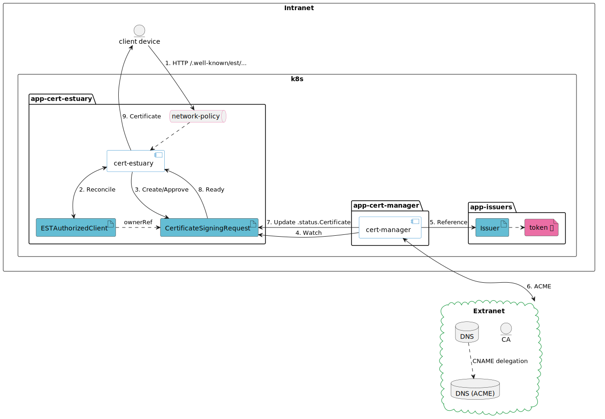

[](https://github.com/hsn723/cert-estuary/releases)
[](https://github.com/hsn723/cert-estuary/releases)
[](https://artifacthub.io/packages/helm/cert-estuary/cert-estuary)
[](https://github.com/Hsn723/cert-estuary/actions/workflows/main.yml)
[](https://pkg.go.dev/github.com/hsn723/cert-estuary?tab=overview)
[](https://goreportcard.com/report/github.com/hsn723/cert-estuary)


# cert-estuary

`cert-estuary` is a Kubernetes controller that provides a bridge between EST and ACME for certificate creation and renewal.



## Features

`cert-estuary` exposes the following required EST ([RFC 7030: Enrollment over Secure Transport](https://datatracker.ietf.org/doc/html/rfc7030)) endpoints to EST clients:

- /cacerts
- /simplenroll
- /simplereenroll

The following client authentication methods are supported:

- Certificate-based client authentication
- HTTP Digest authentication (fallback when configured)

Authorized clients are defined via the `ESTAuthorizedClient` custom resource, allowing administrators to specify which devices are permitted to request certificates. It is recommended to also prevent access to the `cert-estuary` HTTP endpoints by putting NetworkPolicies in place, the details of which is left as an exercise to cluster administrators.

## Motivation

Obtaining a certificate for workloads inside a Kubernetes cluster via ACME is made easy via tools like `cert-manager`. However, for workloads and devices outside the cluster, such as network switches, obtaining and automatically renewing certificates is not always a trivial task. `cert-estuary` aims to reduce this friction by providing a seamless bridge between EST, which several network devices like Cisco devices usually support, and ACME, allowing users to obtain publicly trusted certificates without having to maintain an internal CA.

## Installation

It is recommended to have `cert-manager` installed first, optionally in a different namespaces for better security. At the time of writing, to generate certificates from [`CertificateSigningRequest`](https://kubernetes.io/docs/reference/access-authn-authz/certificate-signing-requests/) resources, the feature-gate must be enabled in `cert-manager`:

```sh
--feature-gates=ExperimentalCertificateSigningRequestControllers=true
```

The easiest way to install `cert-manager` is via Helm:

```sh
helm install \
  cert-manager jetstack/cert-manager \
  --namespace cert-manager \
  --create-namespace \
  --set featureGates="ExperimentalCertificateSigningRequestControllers=true" \
  --set crds.enabled=true
```

Since `cert-estuary` works on the Kubernetes build-in `CertificateSigningRequest` resource, it is also possible to use signers other than `cert-manager`.

`cert-estuary` can be installed via Helm:

```sh
helm repo add cert-estuary https://hsn723.github.io/cert-estuary
helm repo update

helm install --create-namespace --namespace app-cert-estuary cert-estuary cert-estuary/cert-estuary
```

### Post-installation

A server certificate is also required to secure access to the EST server as EST only works over TLS.

The default Role for the `cert-estuary` service account has broad permissions for ease of setup. It is recommended to adjust the permissions accordingly. Namely, as `CertificateSigningRequests` are cluster scoped resources, they can reference `Issuers` in arbitrary namespaces. Kubernetes prevents that by [requiring explicit permissions](https://cert-manager.io/docs/usage/kube-csr/#referencing-namespaced-issuers). The Helm chart sets permission to `reference` the `signers.cert-manager.io` resource on all `resourceNames`. Adjust the permissions accordingly, for example by restricting `resourceNames` to exactly match `Issuers` that `cert-estuary` should be permitted to reference.

An `Issuer` or `ClusterIssuer` is also needed to sign `CertificateSigningRequests`. It is recommended to use the namespace-scoped `Issuer` and to place it in another namespace than `cert-estuary`. By doing so, `cert-estuary` will never be able to access the credentials necessary to update DNS records for ACME DNS-01 DCV.

## Usage

Authorized EST clients can be defined via the `ESTAuthorizedClient` custom resource.

```yaml
apiVersion: cert-estuary.atelierhsn.com/v1
kind: ESTAuthorizedClient
metadata:
    name: cisco-ipsec
    namespace: app-cert-estuary
spec:
    subject: ipsec.example.com
    subjectAltNames:
        - cisco.example.com
        - ipsec2.example.com
    signerName: issuers.cert-manager.io/app-cert-estuary.my-issuer

    # By default, CertificateSigningRequests are automatically approved.
    # To require manual approval by administrators before issuing certificates,
    # or if another controller such as cert-manager's approver-policy is in place,
    # set this to false.
    csrAutoApprove: true

    duration: 1128h # 47d
```

When requesting or renewing a certificate, via the EST `/simpleenroll` or `/simplereenroll` endpoints, `cert-estuary` validates the client by looking for an `ESTAuthorizedClient` matching the CommonName in the CSR. These values must then match the client certificate presented during the initial TLS handshake.

In the future, if no client certificate is available, `cert-estuary` may rely on alternate authentication methods such as TLS-SRP or HTTP Basic/Digest if a pre-shared key is configured but at the time being, **only client certificate authentication is supported** so client devices must first be bootstrapped with a publicly trusted certificate.

Once the EST client is properly authenticated, the CSR payload is saved into a Kubernetes built-in `CertificateSigningRequest` resource for `cert-manager` to handle.

```yaml
apiVersion: certificates.k8s.io/v1
kind: CertificateSigningRequest
metadata:
    name: cisco-ipsec-12345
    namespace: app-cert-estuary
spec:
    signerName: issuers.cert-manager.io/app-cert-estuary.my-issuer
    request: |
        -----BEGIN CERTIFICATE REQUEST-----
        ...
        -----END CERTIFICATE REQUEST-----
```

If using manual approval (`.spec.csrAutoApprove=false`), an administrator must [approve](https://cert-manager.io/docs/usage/kube-csr/#usage) the `CertificateSigningRequest` via `kubectl`.

```sh
kubectl -n app-cert-estuary certificate approve cisco-ipsec-12345
```

When using DNS-01 ACME DCV, it is recommended to use [CNAME delegation](https://atelierhsn.com/2022/01/cert-manager-done-right/) so that `cert-manager` is not presented with a token which can write to the entire DNS zone.

Until the certificate is available, `cert-estuary` will respond with the HTTP status code 202 to indicate to EST clients that their request has been received but that the certificate is pending. Once `cert-manager` is done obtaining the certificate, it is written to the `.status.certificate` field of the `CertificateSigningRequest`. `cert-estuary` will then retrieve the certificate in that field and provide it to the EST client.

If certificate auto-renewal is enabled via the `.spec.autoRenew=true` field for the `ESTAuthorizedClient`, the certificate is automatically renewed according to `.spec.renewBefore` or `.spec.renewBeforePercentage`. If both are specified, the earliest renewal threshold is prioritized. When an EST client requests certificate renewal via `/simplereenroll`, if a pre-emptively renewed certificate exists it is returned to the client. If during the `/simplereenroll` the CSR differs from the renewed certificate, for example for a rekey operation, a new certificate is created with the correct data and returned to the EST client when it is ready.
